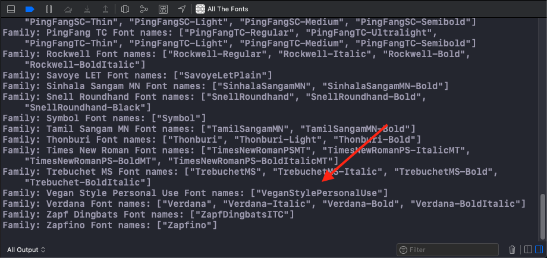

# CustomFonts

A Swift package that includes custom fonts.

## Installation

Add the SPM package to your Xcode project at `main`

`https://github.com/andrewmarmion/CustomFonts.git`

## Usage

In your AppDelegate:

`import CustomFonts`

Then in `didFinishLaunchingWithOptions` add `registerFonts()`

```
func application(_ application: UIApplication, didFinishLaunchingWithOptions launchOptions: [UIApplication.LaunchOptionsKey: Any]?) -> Bool {

    // This code checks that the files are included in the CustomFonts bundle
    if let files = try? FileManager.default.contentsOfDirectory(atPath: CustomFonts.fontBundle.bundlePath ) {
        for file in files {
            print(file)
        }
    }

    // This registers the fonts
    registerFonts()


    // This code checks all the names of the fonts that have been installed. This is definitely worthwhile including the first time you install the fonts.
    for family in UIFont.familyNames.sorted() {
        let names = UIFont.fontNames(forFamilyName: family)
        print("Family: \(family) Font names: \(names)")
    }

    return true
}
```

>Note that the names of these fonts can differ greatly from the filenames. 
>Use the above code in the AppDelegate to check the name of the fonts.
>It will produce a similar output to the image below. The strings inside the `[]` are the names of the fonts. 
> These names are what you should use in your code. Quite often they have a suffix telling you whether they are **Bold** or *Italic* etc. 



### SwiftUI

Use `Font.custom(_:size:)` to use your font. 
```
struct ContentView: View {
    var body: some View {
        VStack(spacing: 20) {
            Text("Hello San Francisco")
            Text("Hello BeautifulPeoplePersonalUse").font(Font.custom("BeautifulPeoplePersonalUse", size: 16))
            Text("Hello VeganStylePersonalUse").font(Font.custom("VeganStylePersonalUse", size: 16))
        }
    }
}
```
### UIKit
```
class ViewController: UIViewController {

    override func viewDidLoad() {
        super.viewDidLoad()

        let label = UILabel(frame: .zero)
        label.text = "Hello San Francisco"
        label.font = UIFont(name: "San Francisco", size: 16)

        let label1 = UILabel(frame: .zero)
        label1.text = "Hello BeautifulPeoplePersonalUse"
        label1.font = UIFont(name: "BeautifulPeoplePersonalUse", size: 16)

        let label2 = UILabel(frame: .zero)
        label2.text = "Hello VeganStylePersonalUse"
        label2.font = UIFont(name: "VeganStylePersonalUse", size: 16)

        let stack = UIStackView(frame: .zero)
        stack.axis = .vertical
        stack.alignment = .center
        stack.translatesAutoresizingMaskIntoConstraints = false

        stack.addArrangedSubview(label)
        stack.addArrangedSubview(label1)
        stack.addArrangedSubview(label2)

        view.addSubview(stack)

        NSLayoutConstraint.activate([
            stack.centerYAnchor.constraint(equalTo: view.centerYAnchor),
            stack.centerXAnchor.constraint(equalTo: view.centerXAnchor)
        ])
    }
}
```
